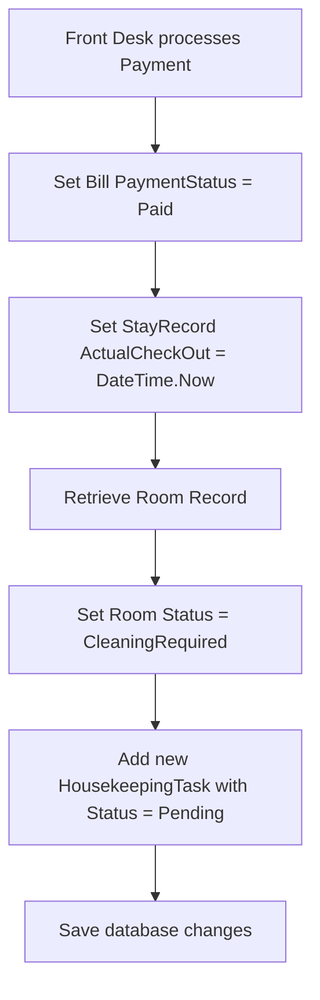

# 💻 CogStay Backend Architecture & Code Guide

This guide is written for backend engineers and project evaluators to understand the internal structure, dependency injection lifetimes, middleware configurations, database schemas, and workflows in the **CogStay** application.

---

## 🏗 Architecture Patterns

CogStay is built on **ASP.NET Core MVC** and follows clean coding principles using the **Repository and Service Patterns**:

1.  **Presentation Layer (Controllers & Views):** Receives HTTP requests, executes model validations, invokes the service layer, and returns views (HTML/Razor) or DTOs.
2.  **Service Layer (Business Logic):** Handles core validation rules, date checking, password hashing, and coordinates data transitions. It is completely decoupled from the data access framework.
3.  **Repository Layer (Data Access):** Abstracts database query operations (EF Core) using a Generic Repository (`IRepository<T>`) alongside specialized entity repository extensions (e.g. `IStaffRepository`).
4.  **Data Layer (DbContext & Models):** Contains database contexts, Fluent API configuration mappings, and structural database tables.

---

## ⚙ Startup & Middleware Configuration (`Program.cs`)

The system startup is configured in `Program.cs`. Here is a line-by-line breakdown of registrations and pipelines:

*   **Database Registration:**
    ```csharp
    builder.Services.AddDbContext<HotelDbContext>(options =>
        options.UseSqlServer(builder.Configuration.GetConnectionString("DefaultConnection")));
    ```
    Configures Entity Framework to use Microsoft SQL Server provider, reading the server details from `appsettings.json`.

*   **Dependency Injection Lifetimes:**
    *   **Generic Repository:** Registered as `Scoped` (one instance per HTTP request lifecycle).
        ```csharp
        builder.Services.AddScoped(typeof(IRepository<>), typeof(Repository<>));
        ```
    *   **Specialized Repositories & Services:** All registered as `Scoped` to maintain transaction integrity.
        ```csharp
        builder.Services.AddScoped<IGuestRepository, GuestRepository>();
        builder.Services.AddScoped<IGuestService, GuestService>();
        ```

*   **Session State Middleware:**
    Registered to handle manual login context tracking:
    ```csharp
    builder.Services.AddSession(options =>
    {
        options.IdleTimeout = TimeSpan.FromMinutes(30); // Session expires after 30 mins
        options.HttpOnly = true;                        // Prevents XSS script access
        options.IsEssential = true;                     // Mandatory cookie policy bypass
    });
    ```

*   **HTTP Request Pipeline Mappings:**
    *   `UseStaticFiles()`: Serves stylesheets, scripts, and images.
    *   `UseRouting()`: Sets up MVC route matching.
    *   `UseSession()`: Activates session memory state before executing controllers.
    *   `UseAuthorization()`: Secures endpoint resources.
    *   `MapControllerRoute()`: Maps MVC controllers with standard `"{controller=Home}/{action=Index}/{id?}"` mapping, as well as role-specific MVC routing folders.

---

## 🗄 Database Model Configurations (`HotelDbContext.cs`)

The `HotelDbContext` class configures tables, keys, decimal precisions, unique constraints, and cascade delete actions via the EF Core **Fluent API**:

### 1. Precision Mappings
By default, EF Core issues warnings if decimal types are not given explicit SQL Server column precisions. The context maps these:
```csharp
modelBuilder.Entity<Room>()
    .Property(r => r.PricePerNight)
    .HasPrecision(18, 2); // Up to 18 digits with 2 decimal places (e.g. $999999.99)

modelBuilder.Entity<Billing>()
    .Property(b => b.TotalAmount)
    .HasPrecision(18, 2);
```

### 2. Unique Index Constraints
To prevent duplicate records at the database level:
*   `Guest.Email` is configured as a Unique Index.
*   `Room.RoomNumber` is configured as a Unique Index.
*   `Staff.Email` is configured as a Unique Index.

```csharp
modelBuilder.Entity<Guest>()
    .HasIndex(g => g.Email)
    .IsUnique();
```

### 3. Deletion Cascade Mappings (`DeleteBehavior.Restrict` vs. `Cascade`)
To prevent accidental record orphan deletion cascades, relationships are mapped as follows:
*   `Guest` has many `Reservations` and `StayRecords` with `DeleteBehavior.Restrict` — deleting a Guest account will be blocked if active stay/booking records exist.
*   `Room` has many `Reservations` and `HousekeepingTasks` with `DeleteBehavior.Restrict`.
*   `Reservation` has a one-to-one link to `StayRecord` (`DeleteBehavior.Restrict`).
*   `StayRecord` has a one-to-one link to `Billing` configured as `DeleteBehavior.Cascade` — deleting a stay record automatically cascades to remove the invoice bill from database memory.

---

## 🔒 Security & Password Encryption

Credentials are never stored in plain text. Both `GuestService.cs` and `StaffService.cs` implement a private encryption utility:

```csharp
private static string HashPassword(string password)
{
    using var sha256 = SHA256.Create();
    var bytes = sha256.ComputeHash(Encoding.UTF8.GetBytes(password));
    return Convert.ToBase64String(bytes);
}
```

This hashes passwords into a fixed-length **SHA-256 Base64 representation**. When users attempt logging in, their inputs are hashed and compared directly against database records.

---

## 🔄 Dynamic Operational Event Mappings

A key business logic sequence resides inside `BillingService.ProcessPaymentAsync` where room status transitions and housekeeping cleaning cycles are automatically triggered:



When a housekeeper later starts the task, the room transitions to `CleaningInProgress`. Once completed, the room status shifts back to `Available`, completing the operational event cycle.

---
*For folder layouts, refer to the [PROJECT_STRUCTURE.md](file:///c:/Users/farha/OneDrive/Desktop/CogStay--Final/CogStay---Project2/PROJECT_STRUCTURE.md) file.*
