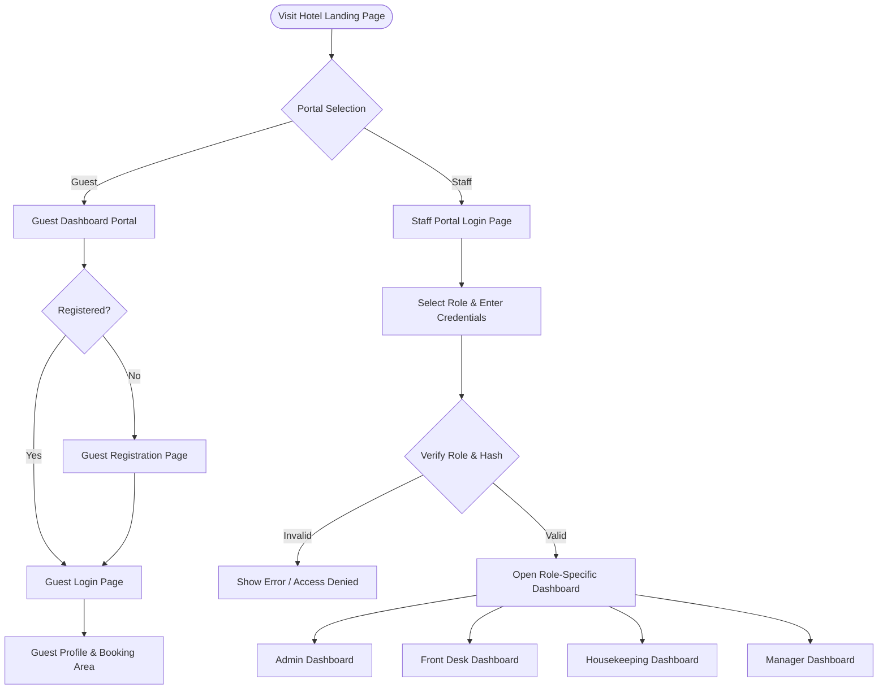
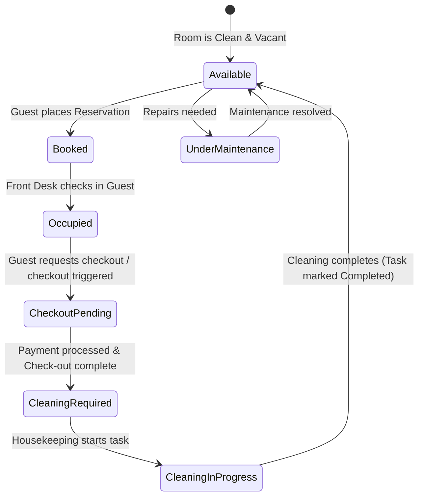
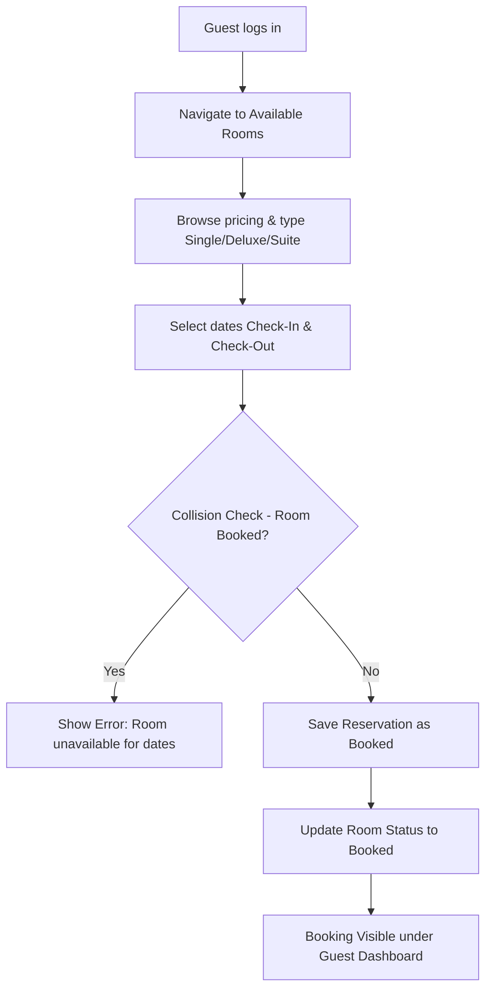
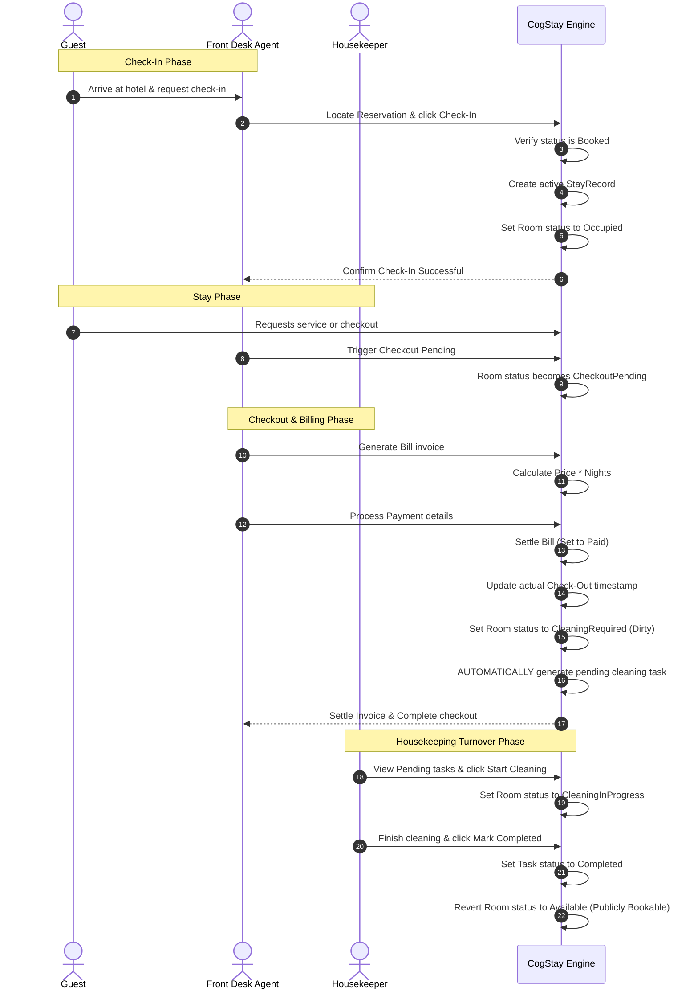

# 🔄 System Workflows & Operational Flowcharts

This document describes the step-by-step operational workflows in the **CogStay** application. It maps out how different roles interact and how room statuses transition through the booking-stay-checkout-cleaning cycle.

---

## 🗺 1. Main Navigation & Portal Entry

When a user visits the application, they land on the Hotel Homepage and can branch into Guest or Staff workflows:

---

## 🛏 2. The Room Lifecycle & Status State Machine

A central feature of CogStay is the tracking of room states to coordinate bookings, stays, and turnovers.

---

## 📅 3. Guest Booking Workflow

This chart shows how a guest searches for rooms and confirms a reservation:

---

## 🔑 4. Check-In & Check-Out Operational Flow

This flow covers guest arrival, service execution, billing invoice, and room turnover:

---
*Refer to the [USER_MANUAL.md](file:///c:/Users/farha/OneDrive/Desktop/CogStay--Final/CogStay---Project2/USER_MANUAL.md) for step-by-step navigation instructions.*
